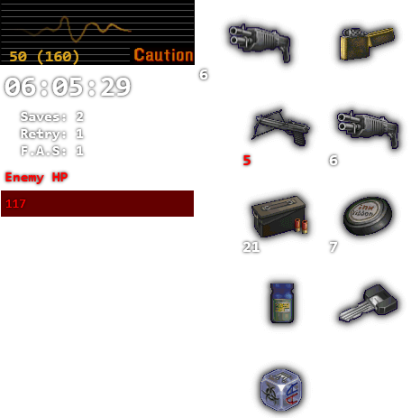

{{ site.product_name }} is a speedrun tool for [{{ site.game_name }}](https://en.wikipedia.org/wiki/Resident_Evil_%E2%80%93_Code:_Veronica){:target="_blank" rel="noopener"} that works with [PCSX2](https://pcsx2.net/){:target="_blank" rel="noopener"} and [RPCS3](https://rpcs3.net/){:target="_blank" rel="noopener"} emulators.  


*Last Update:  {{ post.date | date: "%F" }} ([Changelog](changelog.html))*.


## Installation

1. Download and extract the latest version of **[SRT Host](https://www.neonblu.com/SRT/){:target="_blank" rel="noopener"}**.
2. Download the latest **[{{ site.product_name }} Plugin Pack {{ site.github.latest_release.name }}]({{ asset.browser_download_url }})**.
3. Extract the Plugin Pack contents to SRT Host **plugins** folder.
4. Run **SRTHost64.exe** and start {{ site.game_name }} using a [supported emulator](#support).

## Features

* Enemy health.
* Player health.
* Poison status.
* Gassed status (Poisoned by Nosferatus gas attack).
* Inventory display.
* Equipped weapon.
* In-game timer.
* Retires used.
* Saves used.
* F.A.S. used.
* Customizable interface.
* JSON HTTP Server via **[SRTPluginUIJSON](https://github.com/Squirrelies/SRTPluginUIJSON/){:target="_blank" rel="noopener"}**.

### Planned

* Rank/score tracking.
* DirectX overlay.

## Support

The following emulators and game releases are currently supported.

### [RPCS3](https://rpcs3.net/){:target="_blank" rel="noopener"}

PlayStation 3 releases:

  - [**NPJB00135**] [JP] BioHazard: Code: Veronica Kanzenban
  - [**NPUB30467**] [US] {{ site.game_name }} X HD
  - [**NPEB00553**] [EU] {{ site.game_name }} X

### [PCSX2](https://pcsx2.net/){:target="_blank" rel="noopener"}

PlayStation 2 releases:

  - [**SLPM-650.22**] [JP] BioHazard: Code: Veronica Kanzenban 
  - [**SLUS-201.84**] [US] {{ site.game_name }} X
  - [**SLES-503.06**] [EU] {{ site.game_name }} X
